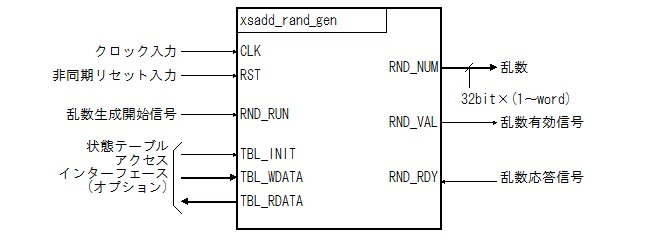

XORSHIFT-ADD(XSAdd) Pseudo Random Number Generator
==================================================


# Overview


## Introduction


このIPは XORSHFIT-ADD(XSAdd)法による擬似乱数生成回路です。

こちらを参考に書いてみました。[XORSHIFT-ADD (XSadd):   
A variant of XORSHIFT](http://www.math.sci.hiroshima-u.ac.jp/~m-mat/MT/XSADD/index-jp.html)


## Features


* XORSHFIT-ADD(XSAdd)法による擬似乱数生成回路です。

* VHDLで記述しています。

* 論理合成可能です。Xilinx社のVivado、Altera社のQuartusIIで確認済み。

* １クロックで1〜数ワード(1ワードは32bit)の乱数を生成します。

* ジェネリック変数でSEED値を設定できます。

* 状態テーブルを書き換えることが可能です。




Fig.1 Top-Level Signaling Interface

<br />


## Licensing


二条項BSDライセンス (2-clause BSD license) で公開しています。


# Specification


## Parameter Descriptions


Table.1 Parameter Descriptions

<table border="2">
  <tr>
    <td align="center">Name</td>
    <td align="center">TYPE</td>
    <td align="center">Default</td>
    <td align="center">Description</td>
  </tr>
  <tr>
    <td>L</td>
    <td align="center">Integer</td>
    <td align="center">1</td>
    <td>1クロックで生成する乱数の数を指定します<br />このパラメータで指定できる数は１以上の整数です</td>
  </tr>
  <tr>
    <td>SEED</td>
    <td align="center">Integer</td>
    <td align="center">1234</td>
    <td>乱数のシード値を指定しますこのシード値を元に状態テーブルが初期化されます</td>
  </tr>
</table>


## Port Descriptions


Table.2 Port  Descriptions

<table border="2">
  <tr>
    <td align="center">Name</td>
    <td align="center">Type</td>
    <td align="center">Width</td>
    <td align="center">I/O</td>
    <td align="center">Description</td>
  </tr>
  <tr>
    <td>CLK</td>
    <td align="center">STD_LOGIC</td>
    <td align="center">1</td>
    <td align="center">in</td>
    <td>クロック信号</td>
  </tr>
  <tr>
    <td>RST</td>
    <td align="center">STD_LOGIC</td>
    <td align="center">1</td>
    <td align="center">in</td>
    <td>非同期リセット信号</td>
  </tr>
  <tr>
    <td>RND_RUN</td>
    <td align="center">STD_LOGIC</td>
    <td align="center">1</td>
    <td align="center">in</td>
    <td>乱数生成開始信号<br />この信号が&#39;1&#39;になってから1クロック後に乱数を出力します<br />TBL_INITが&#39;1&#39;の時、この信号を&#39;1&#39;にしてはいけません</td>
  </tr>
  <tr>
    <td>RND_NUM</td>
    <td align="center">STD_LOGIC_VECTOR</td>
    <td align="center">32*L</td>
    <td align="center">out</td>
    <td>乱数出力信号<br />生成された乱数を出力する信号RND_VALが&#39;1&#39;の時のみ有効な値を出力しますRND_VAL=&#39;1&#39;かつRND_RDY=&#39;1&#39;で次の乱数を生成します</td>
  </tr>
  <tr>
    <td>RND_VAL</td>
    <td align="center">STD_LOGIC</td>
    <td align="center">1</td>
    <td align="center">out</td>
    <td>乱数有効信号<br />RND_NUMより生成された乱数が有効であることを示す信号</td>
  </tr>
  <tr>
    <td>RND_RDY</td>
    <td align="center">STD_LOGIC</td>
    <td align="center">1</td>
    <td align="center">in</td>
    <td>乱数応答信号<br />RND_NUMの値を取り出したことを示す信号RND_VAL=&#39;1&#39;かつRND_RDY=&#39;1&#39;で次の乱数を生成します</td>
  </tr>
  <tr>
    <td>TBL_INIT</td>
    <td align="center">STD_LOGIC</td>
    <td align="center">1</td>
    <td align="center">in</td>
    <td>状態テーブル・初期化信号<br />状態テーブルを初期化することを示します状態テーブルを明示的に初期化しない場合はこの信号を&#39;0&#39;にしてください。TBL_INITを&#39;0&#39;にしてから乱数が生成されるまで2クロックの遅れが生じます。</td>
  </tr>
  <tr>
    <td>TBL_WDATA</td>
    <td align="center">STD_LOGIC_VECTOR</td>
    <td align="center">128</td>
    <td align="center">in</td>
    <td>状態テーブル・ライトデータ</td>
  </tr>
  <tr>
    <td>TBL_RDATA</td>
    <td align="center">STD_LOGIC_VECTOR</td>
    <td align="center">128</td>
    <td align="center">out</td>
    <td>状態テーブル・リードデータ</td>
  </tr>
</table>


## Timing Diagram


")

Fig.2 Generate Timing (L=1)

<br />


")

Fig.3 Generate Timing (L=4)

<br />


## Resouces and Performance


Xilinx社のFPGAで実装してみた結果を以下に示します。

Performanceの生成速度は１秒間に生成できるワード数(1ワードは32bit)の理論値です。

Table.3 Resouces and Performance(Xilinx)

<table border="2">
  <tr>
    <td align="center" colspan="2" rowspan="2">Device</td>
    <td align="center" rowspan="2">Parameter</td>
    <td align="center" colspan="3">Resouces</td>
    <td align="center" colspan="2" rowspan="2">Performance</td>
  </tr>
  <tr>
    <td align="center" rowspan="2">Slices</td>
    <td align="center" colspan="2">LUT</td>
  <tr>
    <td align="center">Family</td>
    <td align="center">Speed</td>
    <td align="center">L</td>
    <td align="center">Logic</td>
    <td align="center">F/F</td>
    <td align="center">Fmax</td>
    <td align="center">Generate word/sec</td>
  </tr>
  <tr>
    <td rowspan="14">Artix-7</td>
    <td align="center" rowspan="14">3</td>
    <td align="center">1</td>
    <td align="right">28</td>
    <td align="right">66</td>
    <td align="right">106</td>
    <td align="right">250[MHz]</td>
    <td align="right">250[Mword/sec]</td>
  </tr>
  <tr>
    <td align="center">2</td>
    <td align="right">49</td>
    <td align="right">162</td>
    <td align="right">186</td>
    <td align="right">250[MHz]</td>
    <td align="right">500[Mword/sec]</td>
  </tr>
  <tr>
    <td align="center">3</td>
    <td align="right">78</td>
    <td align="right">258</td>
    <td align="right">283</td>
    <td align="right">250[MHz]</td>
    <td align="right">750[Mword/sec]</td>
  </tr>
  <tr>
    <td align="center">4</td>
    <td align="right">110</td>
    <td align="right">372</td>
    <td align="right">388</td>
    <td align="right">250[MHz]</td>
    <td align="right">1000[Mword/sec]</td>
  </tr>
  <tr>
    <td align="center">5</td>
    <td align="right">134</td>
    <td align="right">454</td>
    <td align="right">495</td>
    <td align="right">250[MHz]</td>
    <td align="right">1250[Mword/sec]</td>
  </tr>
  <tr>
    <td align="center">6</td>
    <td align="right">159</td>
    <td align="right">551</td>
    <td align="right">575</td>
    <td align="right">250[MHz]</td>
    <td align="right">1500[Mword/sec]</td>
  </tr>
  <tr>
    <td align="center">7</td>
    <td align="right">182</td>
    <td align="right">664</td>
    <td align="right">681</td>
    <td align="right">250[MHz]</td>
    <td align="right">1750[Mword/sec]</td>
  </tr>
  <tr>
    <td align="center">8</td>
    <td align="right">211</td>
    <td align="right">764</td>
    <td align="right">797</td>
    <td align="right">250[MHz]</td>
    <td align="right">2000[Mword/sec]</td>
  </tr>
  <tr>
    <td align="center">12</td>
    <td align="right">344</td>
    <td align="right">1275</td>
    <td align="right">1313</td>
    <td align="right">250[MHz]</td>
    <td align="right">3000[Mword/sec]</td>
  </tr>
  <tr>
    <td align="center">16</td>
    <td align="right">471</td>
    <td align="right">1759</td>
    <td align="right">1798</td>
    <td align="right">250[MHz]</td>
    <td align="right">4000[Mword/sec]</td>
  </tr>
  <tr>
    <td align="center">20</td>
    <td align="right">627</td>
    <td align="right">2317</td>
    <td align="right">2359</td>
    <td align="right">250[MHz]</td>
    <td align="right">5000[Mword/sec]</td>
  </tr>
  <tr>
    <td align="center">24</td>
    <td align="right">798</td>
    <td align="right">2911</td>
    <td align="right">2985</td>
    <td align="right">250[MHz]</td>
    <td align="right">6000[Mword/sec]</td>
  </tr>
  <tr>
    <td align="center">28</td>
    <td align="right">963</td>
    <td align="right">3566</td>
    <td align="right">3657</td>
    <td align="right">250[MHz]</td>
    <td align="right">7000[Mword/sec]</td>
  </tr>
  <tr>
    <td align="center">32</td>
    <td align="right">1102</td>
    <td align="right">4113</td>
    <td align="right">4226</td>
    <td align="right">250[MHz]</td>
    <td align="right">8000[Mword/sec]</td>
  </tr>
</table>


# Source Code


## src/main/vhdl/xsadd_rand_gen.vhd


```VHDL:xsadd_rand_gen.vhd
library ieee;
use     ieee.std_logic_1164.all;
library XSADD;
entity  XSADD_RAND_GEN is
    generic (
        L           :     integer   := 1;
        SEED        :     integer   := 1234
    );
    port (
        CLK         : in  std_logic;
        RST         : in  std_logic;
        TBL_INIT    : in  std_logic := '0';
        TBL_WDATA   : in  std_logic_vector(127 downto 0) := (others => '0');
        TBL_RDATA   : out std_logic_vector(127 downto 0);
        RND_RUN     : in  std_logic := '1';
        RND_VAL     : out std_logic;
        RND_NUM     : out std_logic_vector(L*32-1 downto 0);
        RND_RDY     : in  std_logic := '1'
    );
end     XSADD_RAND_GEN;
 
```


```VHDL
library ieee;
use     ieee.std_logic_1164.all;
use     ieee.numeric_std.all;
library XSADD;
use     XSADD.XSADD.all;
architecture RTL of XSADD_RAND_GEN is

```


```VHDL
    type      STATUS_VECTOR    is array(integer range <>) of PSEUDO_RANDOM_NUMBER_GENERATOR_TYPE;
    function  RESET_STATUSES(SEED :integer) return STATUS_VECTOR is
        variable  next_status  :  PSEUDO_RANDOM_NUMBER_GENERATOR_TYPE;
        variable  statuses     :  STATUS_VECTOR(L-1 downto 0);
    begin
        next_status := NEW_PSEUDO_RANDOM_NUMBER_GENERATOR(TO_SEED_TYPE(SEED));
        for i in statuses'low to statuses'high loop
            NEXT_PSEUDO_RANDOM_NUMBER_GENERATOR(next_status);
            statuses(i) := next_status;
        end loop;
        return statuses;
    end function;
```


```VHDL
    signal    curr_statuses    :  STATUS_VECTOR(L-1 downto 0);
    signal    random_number    :  RANDOM_NUMBER_VECTOR(L-1 downto 0);
    signal    random_valid     :  boolean;
    signal    initial_next     :  boolean;
    signal    status_valid     :  boolean;
    signal    status_ready     :  boolean;
begin
```


```VHDL
    process(CLK, RST) begin
        if (RST = '1') then
            initial_next <= TRUE;
        elsif (CLK'event and CLK = '1') then
            initial_next <= (TBL_INIT = '1');
        end if;
    end process;

```


```VHDL
    process(CLK, RST)
        variable next_status   :  PSEUDO_RANDOM_NUMBER_GENERATOR_TYPE;
    begin
        if (RST = '1') then
            curr_statuses <= RESET_STATUSES(SEED);
        elsif (CLK'event and CLK = '1') then
            if (TBL_INIT = '1') then
                for i in 0 to 3 loop
                    next_status.status(i) := unsigned(TBL_WDATA(32*(i+1)-1 downto 32*i));
                end loop;
                curr_statuses(curr_statuses'high) <= next_status;
            elsif (initial_next = TRUE) or
                  (status_valid = TRUE and status_ready = TRUE) then
                next_status := curr_statuses(curr_statuses'high);
                for i in curr_statuses'low to curr_statuses'high loop
                    NEXT_PSEUDO_RANDOM_NUMBER_GENERATOR(next_status);
                    curr_statuses(i) <= next_status;
                end loop;
            end if;
        end if;
    end process;
    status_valid <= (initial_next = FALSE and TBL_INIT = '0' and RND_RUN = '1');

```


```VHDL
    process(CLK, RST) begin
        if (RST = '1') then
            random_valid  <= FALSE;
            random_number <= (others => (others => '0'));
        elsif (CLK'event and CLK = '1') then
            random_valid  <= status_valid;
            if (status_valid = TRUE and status_ready = TRUE) then
                for i in curr_statuses'range loop
                    random_number(i) <= GENERATE_TEMPER(curr_statuses(i));
                end loop;
            end if;
        end if;
    end process;
    status_ready <= ((random_valid = FALSE) or
                     (random_valid = TRUE  and RND_RDY = '1'));

```


```VHDL
    RND_VAL <= '1' when (random_valid = TRUE) else '0';
    RND_NUM_GEN: for i in 0 to L-1 generate
        RND_NUM(32*(i+1)-1 downto 32*i) <= std_logic_vector(random_number(i));
    end generate;
    TBL_RDATA_GEN: for i in 0 to 3 generate
        TBL_RDATA(32*(i+1)-1 downto 32*i) <= std_logic_vector(curr_statuses(L-1).status(i));
    end generate;
end RTL;

```


# Simulation


## GHDLによるシミュレーション


### GHDLのバージョン


GHDLのバージョンは0.29です。

GHDLのホームページはこちら(http://ghdl.free.fr)


### Makefile


シミュレーション用に Makefile を用意しています。


```Makefile:Makefile
GHDL=ghdl
GHDLFLAGS=--mb-comments
WORK=XSADD
TEST_BENCH = test_bench \\
             $(END_LIST)
all: $(TEST_BENCH)
clean:
	rm -f *.o *.cf $(TEST_BENCH)
test_bench: xsadd.o xsadd_rand_gen.o test_bench.o 
	 $(GHDL) -e $(GHDLFLAGS) $@
	-$(GHDL) -r $(GHDLRUNFLAGS) $@
test_bench.o:      ../../src/test/vhdl/test_bench.vhd xsadd_rand_gen.o
	$(GHDL) -a $(GHDLFLAGS) --work=work $<
xsadd.o:           ../../src/main/vhdl/xsadd.vhd
	$(GHDL) -a $(GHDLFLAGS) --work=$(WORK) $<
xsadd_rand_gen.o:  ../../src/main/vhdl/xsadd_rand_gen.vhd xsadd.o
	$(GHDL) -a $(GHDLFLAGS) --work=$(WORK) $<

```


### シミュレーションの実行


```Shell
$ cd sim/ghdl
$ cd make
ghdl -a --mb-comments --work=XSADD ../../src/main/vhdl/xsadd.vhd
ghdl -a --mb-comments --work=XSADD ../../src/main/vhdl/xsadd_rand_gen.vhd
ghdl -a --mb-comments --work=work ../../src/test/vhdl/test_bench.vhd
../../src/test/vhdl/test_bench.vhd:174:18:warning: function "to_dec_string" is never referenced
ghdl -e --mb-comments test_bench
ghdl -r  test_bench
xsadd_init(1234)
32-bit unsigned integers r, where 0 <= r < 2^32 
1823491521 1658333335 1467485721   45623648 
3336175492 2561136018  181953608  768231638 
3747468990  633754442 1317015417 2329323117 
 688642499 1053686614 1029905208 3711673957 
2701869769  695757698 3819984643 1221024953 
 110368470 2794248395 2962485574 3345205107 
 592707216 1730979969 2620763022  670475981 
1891156367 3882783688 1913420887 1592951790 
2760991171 1168232321 1650237229 2083267498 
2743918768 3876980974 2059187728 3236392632 
xsadd_init([0x0a, 0x0b, 0x0c, 0x0d])
32-bit unsigned integers r, where 0 <= r < 2^32 
138a38f9 b396fa84 a55a2ee8 24b7ed06 
f0bae2fe d8ace1a7 d4b09a3f d7fcf441 
fc55ee1b 5b4ab585 d4bf254b 5b0f77ba 
31161b97 b21ccc3b ab418bfb 4cc8476a 
06a1a28f cb1f50c6 f0ba2ed3 7907f372 
3256d76c d843e864 d63a60b7 eff88358 
ddc3b083 b5734b65 f08d644d e5f6c809 
95bf2ae3 e5867758 f260d462 39d244dc 
b9fbb8d7 63e8f3d9 b34ea936 8fe4ee75 
8803c8f1 d74e420e a5c14d22 20be253f 
../../src/test/vhdl/test_bench.vhd:373:9:@530ns:(assertion failure):   Run complete...
./test_bench:error: assertion failed
./test_bench:error: simulation failed
Makefile:14: recipe for target 'test_bench' failed
make: [test_bench] Error 1 (無視されました)
```


最後にエラーが出てるように見えますが、これはassert(FALSE)でシミュレーションを終了しているためです。


## Vivadoによるシミュレーション


### Vivadoのバージョン


Vivado 2015.4


### Vivado プロジェクトの作成


すでにプロジェクトを作っている場合は省略してください。

プロジェクトを生成するためのTclスクリプトを用意しています。


sim/vivado/create_project.tcl


上記のTclスクリプトをVivado で実行するとプロジェクトが作成されます。


Vivado > Tools > Run Tcl Script > create_project.tcl


### シミュレーションを実行


Vivado > Open Project > xsadd_rand_gen.xpr

Flow Navigator > Run Simulation > Run Behavioral Simulation


# Synthesis and Implementation


## Vivadoによる論理合成


### Vivadoのバージョン


Vivado 2015.4


### Vivado プロジェクトの作成


すでにプロジェクトを作っている場合は省略してください。

プロジェクトを生成するためのTclスクリプトを用意しています。


fpga/xilinx/vivado2015.4/xsadd_rand_gen/create_project.tcl


上記のTclスクリプトをVivado で実行するとプロジェクトが作成されます。


Vivado > Tools > Run Tcl Script > create_project.tcl


デバイスはとりあえずxc7a15tcsg324-3を指定しますが、変更したい場合は、create_project.tcl を修正してください。


### Synthesis


Flow Navigator > Run Synthesis


### Implementation


Flow Navigator > Run Implementation


## QuartusIIによる論理合成


### QuartusIIのバージョン


Quartus Prime 15.1


### QuartusII用のプロジェクト


fpga/altera/15.1/xsadd_rand_gen.qpf


# Acknowledgments


このような貴重なアルゴリズムを惜しげもなく公開してくださった方々にはひたすら感謝です。

